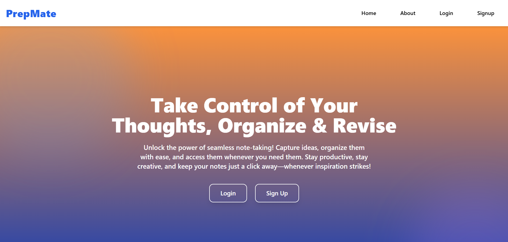
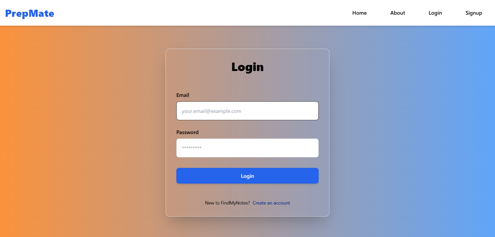
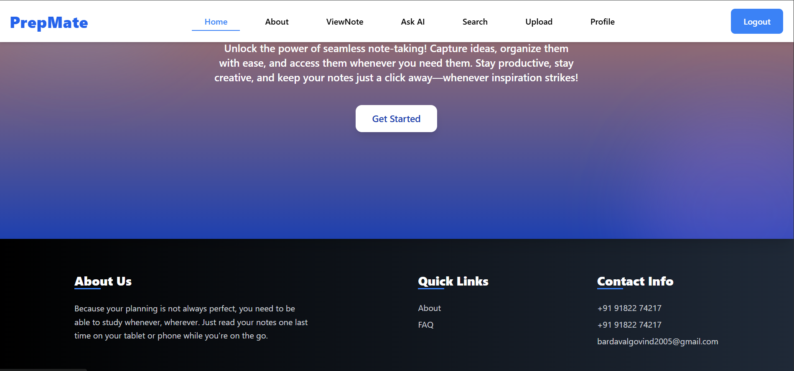
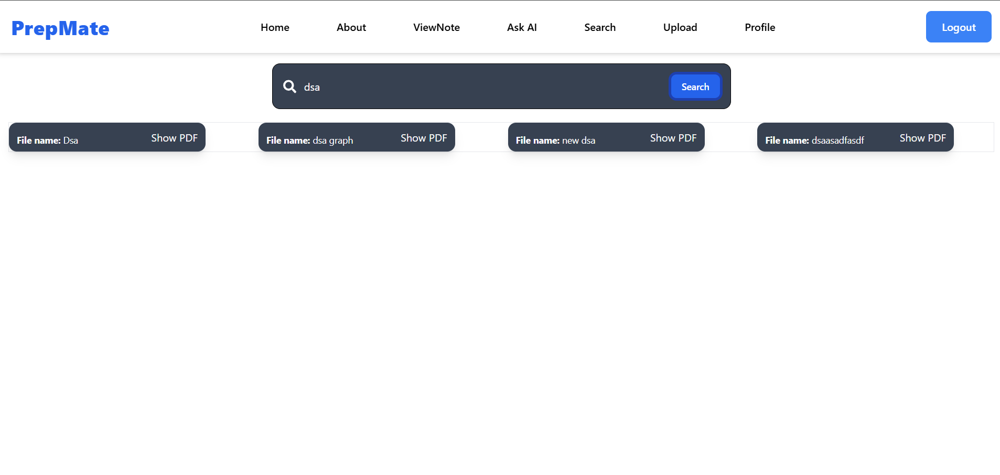
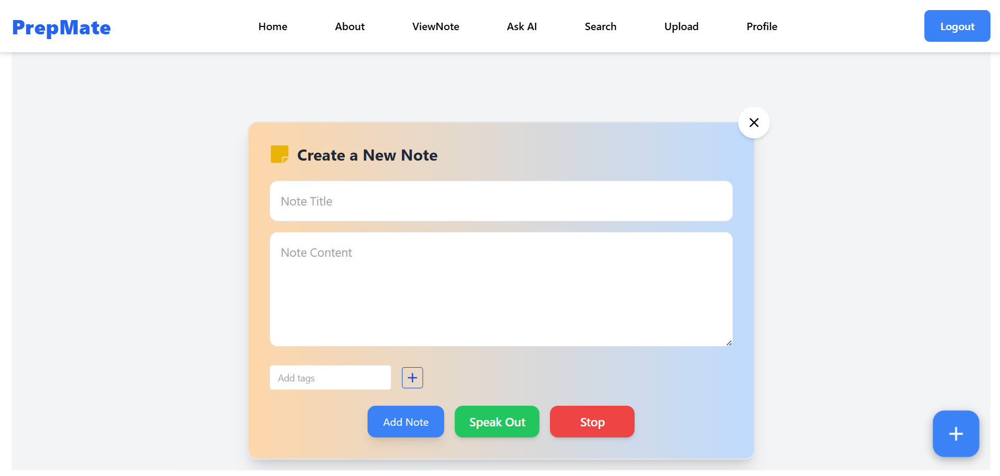
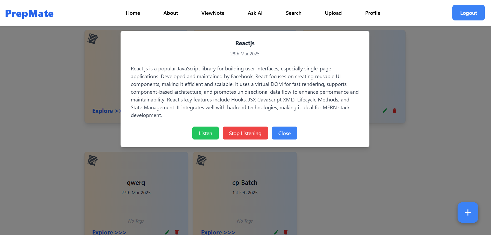
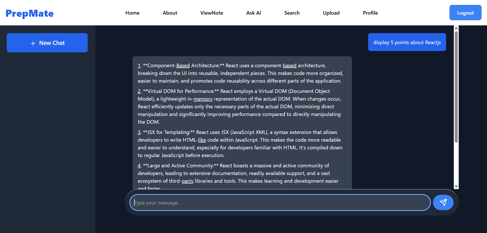

PrepMate – Notes Management Platform

Description
PrepMate is a feature-rich notes management platform designed to enhance the note-taking experience for students and professionals. It provides functionalities for creating, editing, and managing notes, with integrated accessibility features such as speech-to-text for voice-based note-taking and text-to-speech for improved accessibility.
The platform supports PDF uploads, real-time document viewing, and leverages AI-powered Gemini AI for personalized study recommendations, resulting in a 35% improvement in user engagement.

Features

📝 Create, Read, Update, and Delete (CRUD) notes.

📄 PDF upload and viewing functionality.

🎙 Speech-to-text for voice-based note-taking.

🔊 Text-to-speech for accessibility support.

🤖 AI-powered study recommendations via Gemini AI.

📊 Optimized performance with high Lighthouse scores: Performance (100%), Accessibility (95%), Best Practices (100%), SEO (90%).

Tech Stack

Frontend: ReactJS, Tailwind CSS, JavaScript

Backend: NodeJS, Express, MongoDB

Installation & Usage

Clone the repository: git clone https://github.com/BardavalGovind/PrepMate.git

Install dependencies: npm install

Start the backend server: change the directory => cd server, run the command =>  node index.js

Start the Frontend React app: change the directory => cd client, run the command => npm run dev

Live Demo

https://prepmateai.vercel.app/

Screenshots

